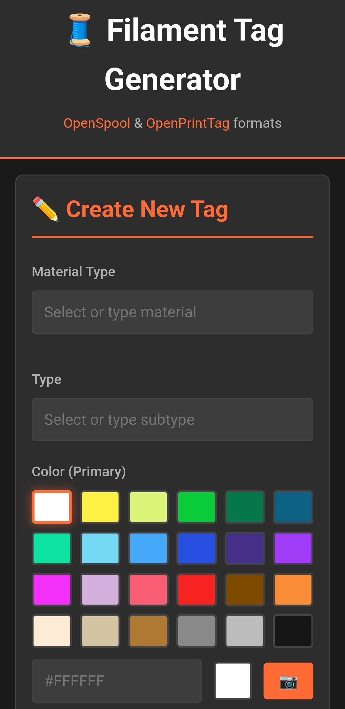
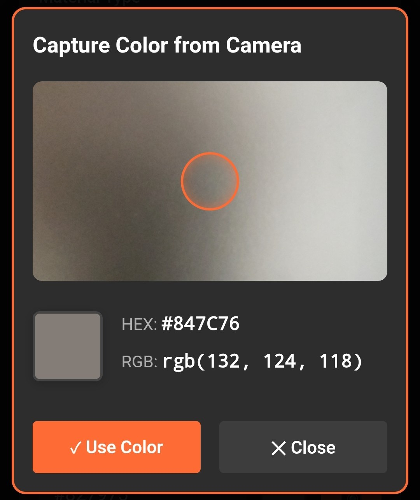
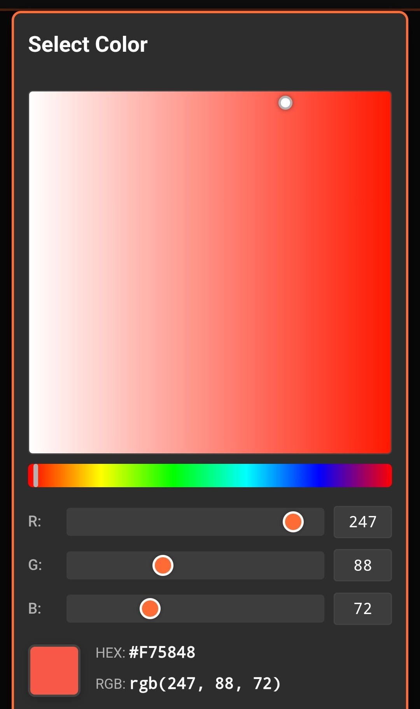
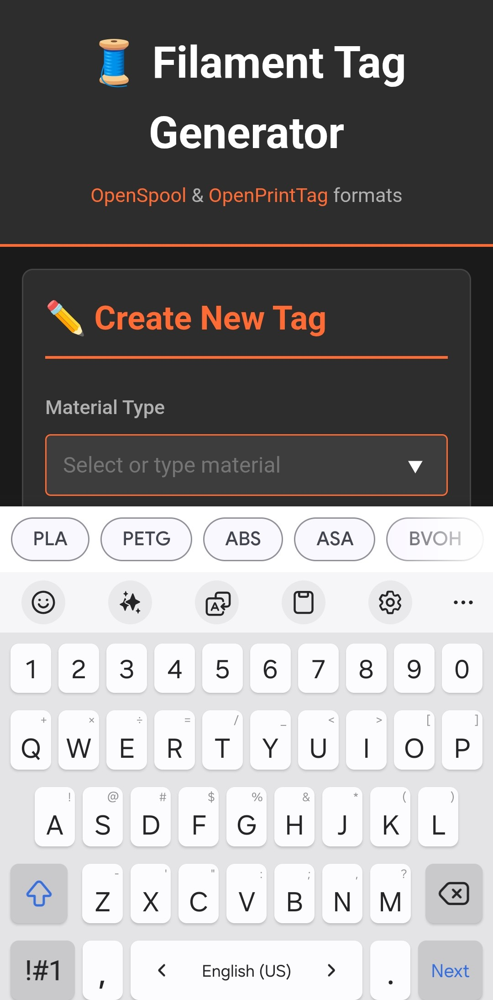

# Filament Tags

A web-based application for creating and managing NFC tags for 3D printing filament spools.

  

## Features

### 🏷️ **NFC Tag Writing**
Write filament information to NFC tags using Web NFC API

### 📱 **Mobile-Optimized**
Touch-friendly interface designed for mobile devices

### 📷 **Camera Color Picker**
Extract colors directly from filament spools using your device camera

  

### 🎨 **Advanced HSV Color Picker**
Precise color selection with hue, saturation, and brightness controls

  

### 📦 **Filaments and Temperature Presets based on market's data**

  

## Usage

1. Open `index.html` in a modern web browser
2. Fill in filament details (name, material, color, temperatures)
3. Use the color picker or camera to select the filament color
4. Tap an NFC tag to write the information

## Requirements

- Modern web browser with Web NFC API support (Chrome/Edge on Android)
- NFC-enabled device for tag writing
- Camera access for color picker feature

## Files

- `index.html` - Main application interface
- `app.js` - Application logic and color picker functionality
- `openspool.js` - OpenSpool format handling and NFC operations

## License

MIT License
